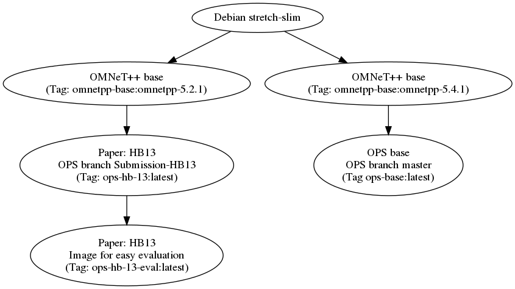

Docker Images by ComNets Bremen
===============================

This repository contains docker images by ComNets Bremen. The corresponding
website on docker hub is
[https://hub.docker.com/r/comnets/](https://hub.docker.com/r/comnets/)

omnetpp-base
------------

A base [OMNeT++](https://omnetpp.org/) images. This does not do anything and is meant as a base image
for deriving new ones.

ops-base
--------

This is a docker image with a basic
[OPS](https://github.com/ComNets-Bremen/OPS) (Opportunistic Protocol Simulator)
installation.

ops-hb-13
---------

This is the base OPS image for the OPS-branch `Submission-HB13` available on
github:
[Submission-HB13](https://github.com/ComNets-Bremen/OPS/tree/Submission-HB13)
